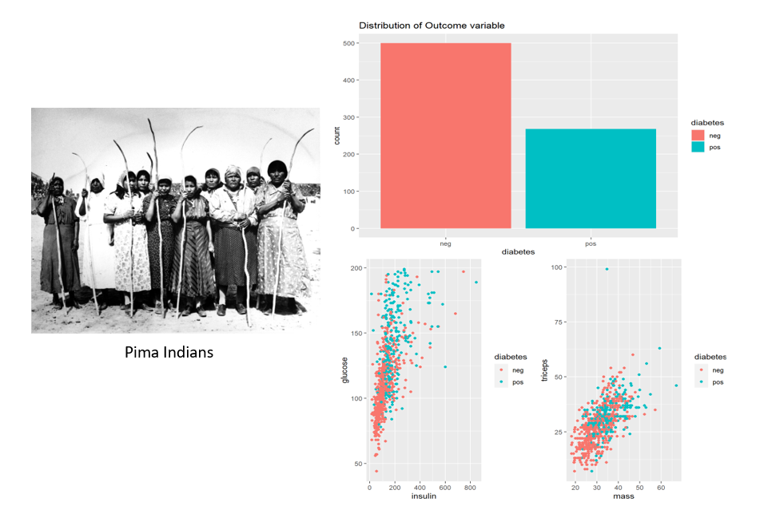

# Portfolio
---
## Data Analysis

### Cardiovascular Disease Analysis

View complete project [here](https://seeying147.github.io/cardiovascular-analysis/).

This project focused on analyzing patients with cardiovascular disease aged 39-64. It involved data cleaning and preprocessing, performing exploratory data analysis (EDA), analyzing the correlation between variables and performing hypothesis testing(e.g.: ANOVA, f-test, t-test).
 

---
### Bellabeat Smart Device Usage Analysis

View complete project [here](https://seeying147.github.io/Bellabeat-Analysis/).

The goal of this project is to recommend marketing strategies to a tech company Bellabeat by investigating the Fitbit Fitness Tracker database. I queried the database in MySQL to perform data manipulation which involved joining multiple tables, creating Common Table Expressions(CTE) and logical conditions. Data visualization is performed to explore the correlation between variables and answer the following questions:

* What is the distribution of the activity level among participants?
* At what time are the average calories, steps and intensity the highest?
* What is the distribution of the weight range among participants?
* How does the sleep performance differ throughout the week?

---
## Data Science

### Pima Indians Diabetes Analysis

View complete project [here](https://seeying147.github.io/pimaindians-diabetes-analysis/).

 The main objective of this study is to determine which factors have the most significant impact on diabetes in women specifically. After performing comprehensive exploratory data analysis to understand important variables, I explored the different machine-learning techniques for prediction and classification. Under prediction, the performance between linear regression and KNN regression models are compared to find out which predictor variables have the highest significance towards ‘glucose’. I used logistic regression for classification to find out our main objective by analysing the p-values and the estimated coefficient.   

 

 

---
## Filmed by me

Besides Data Science, I also have a great passion for photography and videography. Below is a list of films I documented to retain beautiful memories of places I traveled to and amazing people I met on the way.

 

- [Ada Von Weiss - You Regret (Winter at Niagara)](https://www.youtube.com/watch?v=-5esqvmPnHI)
- [The Weight We Carry is Love - TORONTO](https://www.youtube.com/watch?v=vfZwdEWgUPE)
- [In America - Boston 2017](https://www.youtube.com/watch?v=YdXufiebgyc)
- [In America - We Call This Place Our Home (Massachusetts)](https://www.youtube.com/watch?v=jzfcM_iO0FU)

---

© 2020 Khanh Tran. Powered by Jekyll and the Minimal Theme.

