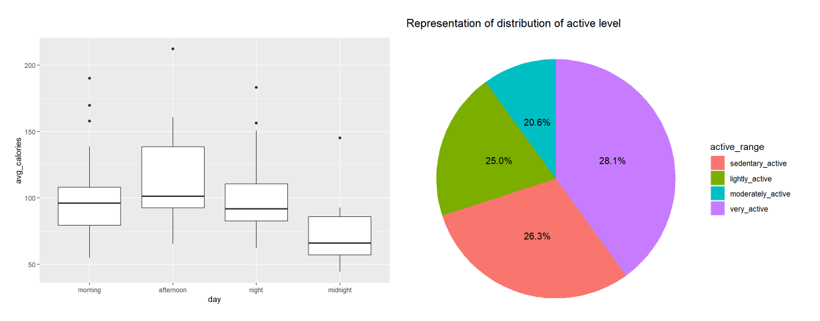

# Portfolio
---
## Data Analysis

### Cardiovascular Disease Analysis

View complete project [here](https://seeying147.github.io/cardiovascular-analysis/).

This project focused on analyzing patients with cardiovascular disease aged 39-64. It involved data cleaning and preprocessing, performing exploratory data analysis (EDA), exploring the correlation between variables and performing hypothesis testing(e.g., ANOVA, f-test, t-test).
 
 

 

---
### Bellabeat Smart Device Usage Analysis

View complete project [here](https://seeying147.github.io/Bellabeat-Analysis/).

This project aims to recommend marketing strategies to a tech company, Bellabeat, by investigating the Fitbit Fitness Tracker database. I queried the database in MySQL to perform data manipulation, which involved joining multiple tables creating Common Table Expressions(CTE) and logical conditions. I performed data visualization to explore the correlation between variables and answer the following questions:
<ol>  
  <li>What is the distribution of the activity level among participants?</li>
  <li>At what time are the average calories, steps and intensity the highest?</li>
  <li>What is the distribution of the weight range among participants?</li>
  <li>How does the sleep performance differ throughout the week?</li> 
</ol>

 

 

---
## Data Science

### Pima Indians Diabetes Analysis

View complete project [here](https://seeying147.github.io/pimaindians-diabetes-analysis/).

 The main objective of this study is to determine which factors have the most significant impact on diabetes in women specifically. After performing comprehensive exploratory data analysis to understand all variables, I explored the different machine-learning techniques for prediction and classification. Under prediction, linear regression and KNN regression models are compared to determine which predictor variables have the highest significance towards ‘glucose’. I used logistic regression for classification to analyse the p-values and the estimated coefficient.

 

 

---

© 2020 Khanh Tran. Powered by Jekyll and the Minimal Theme.

